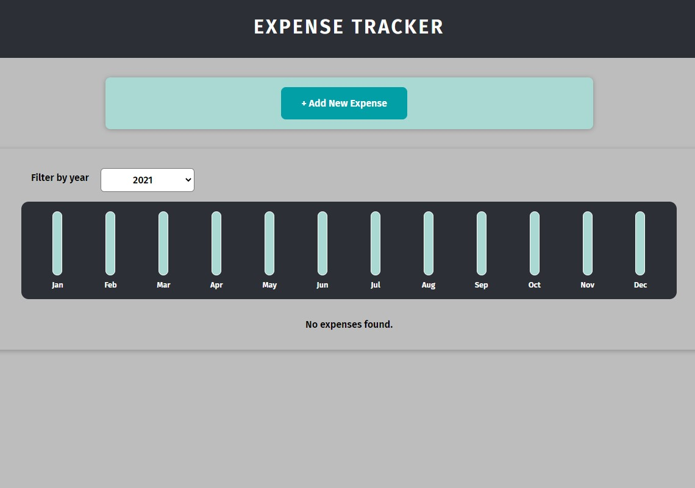
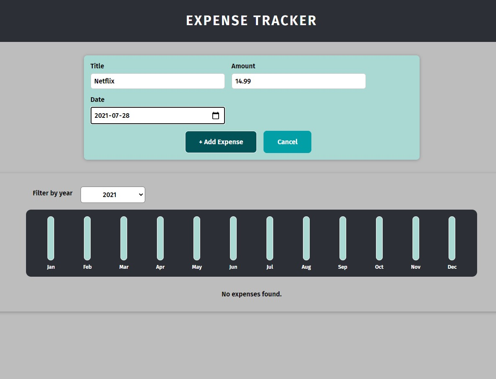
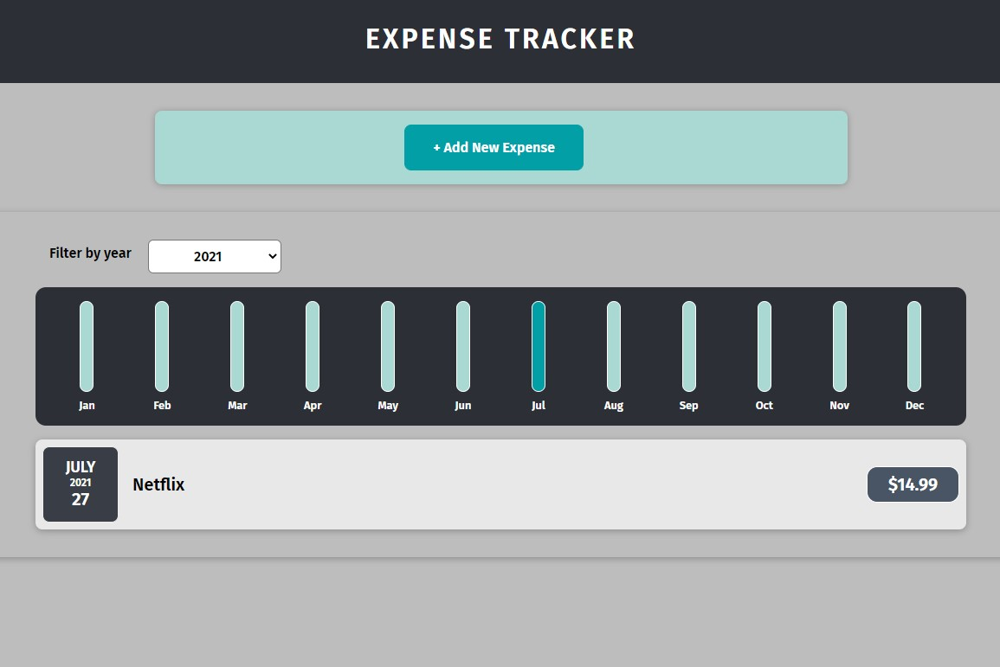

# Expense Tracker Web Application

## Description

This web application let user add the number of expenses they have in a month. The application will
display a chart of all expenses of a given calendar year. Application does not presist the user's
data, therefore, it will be lost when the user closed it.

## About the project

This project was coded while following along the react basic section of Academind's React the Complete Guide course.

## What have I learnt from this project

React concepts such as it component approach to building UI, how to pass data between components by the props system,
JSX, stateful List and two-way binding.

